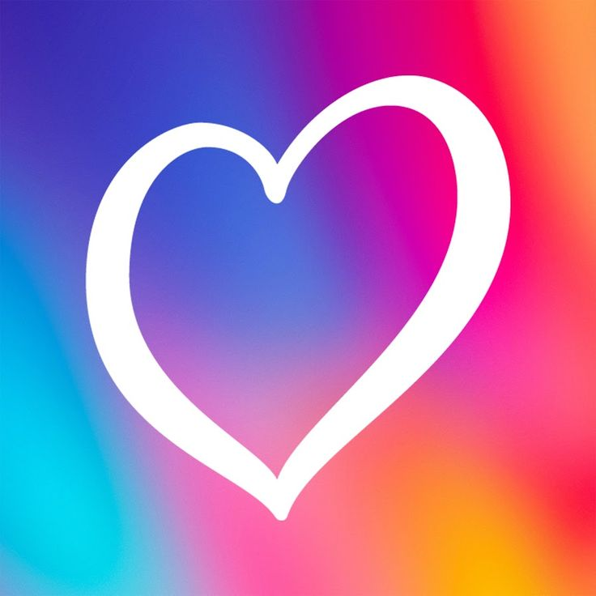

    

---

### 👨‍💻 About Me

Educated as an **Environmental Engineer**, evolved into a **Software Developer**.  
I believe in clean code, meaningful design, and digital experiences that feel timeless.  

My work is guided by clarity, function, and a hint of elegance.  
Currently designing a Eurovision-themed mobile app with refined UI, state management, and a smooth user journey.

---

### 🔧 Tech Stack & Tools

  
  
  
  
  
  

---

### 🚀 Current Project

  <!-- Proje logosunu buraya ekleyebilirsin -->
  

  

🎶 A stylish and interactive Eurovision mobile app built with Flutter  
✨ Features:
- 🎥 Video search, playback, and theming  
- ❤️ Favorite system (Hive)  
- 🏆 Custom **Top 10** rankings + PNG export  
- 🚀 Onboarding using showcaseview  
- 🌗 Light/Dark theme toggle with Provider

👉 [View the Project on GitHub](https://github.com/denizguvel/dEurovisionApp)

---

### 📊 GitHub Stats

  
  

---

### 📫 Contact

  
  
  

---

> *“Stay curious. Build things. Break limits.”*

